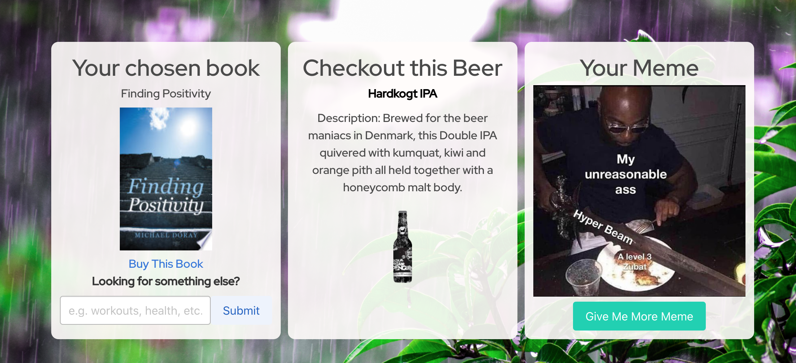

# Project_One
Link: https://github.com/TJFitz/Project_One

Deployment: https://tjfitz.github.io/Project_One/

​
Screenshots: 




​

## User Story 
```
AS A active young adult
I WANT to stay informed about things that can positively affect my day
SO THAT i can maintain a healthy mindset
```

## Acceptance Criteria 
```
GIVEN I am looking for a motivational moment to my day
WHEN I open my dashboard
THEN I am presented with an inspirational quote, followed by a main dashboard that displays information to enhance my day

GIVEN I enter my name and zip code
WHEN I open the dashboard
THEN I am presented with a personalized greeting, forecast, and local events

GIVEN I am interested in a new beer
WHEN I open the dashboard
THEN i presented with a random beer choice

GIVEN I am interested in a book
WHEN I open the dashboard
THEN I presented with a positive themed book

GIVEN I search for a book topic
WHEN I click on the button
THEN I am presented with a new book that matches the topic

GIVEN I would like a laugh
WHEN I open the dashboard
THEN I am presented with a funny meme
​
GIVEN I would want more of a laugh
WHEN I click the button
THEN I am presented with another
```
## Process 
1. Pseudo coded the layout, researched API's, and CSS framework.
2. Started building initial html document with specific classes and id's in order to  interactive with jquery, ajax, and javascript.  
3. Each team member developed one of the API modules. 
4. Integrated javascript file into working application.
5. Developed animation. 
6. Styling UI.
7. Bug Fixes and deployment to Github. 
​
## API's
1. Open Weather - Weather
2. Heroku App - Meme
3. Google Books - Books
4. PunkAPI - Beer
5. Seat Geek - Event
6. Favqs.com - Quotes
​
## Technology
1. Moment.js
2. JQuery
3. Javascript
4. API's
5. Bulma - CSS Framework and Hover.CSS library
6. Greensock - Javascript Library 
7. Reset CSS - http://meyerweb.com/eric/tools/css/reset/
8. AJAX 
9. HTML
10. CSS
